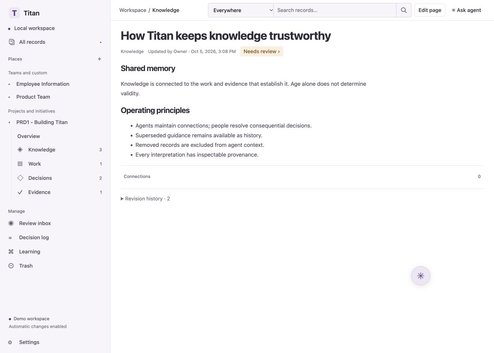

# Titan

**Shared knowledge and work, built around agents.**

[](https://github.com/darin2036/Titan/actions/workflows/check.yml)
[](#license)

Titan brings the core of a knowledge base and a work tracker into one local workspace. Agents author records, connect ideas to work and evidence, and propose changes. People think with the agent, review consequential decisions, and inspect the history behind the system's understanding.

Native records are Markdown in Git. Connected Confluence pages stay in a private local cache until you choose to move them into Titan. The human interface is a readable workspace over that shared memory, while external agents use the same records through MCP or a versioned API.

**Status:** early proof of concept, built for a single owner running locally. You can explore the complete demo without API keys or paid model calls. This is not yet a hosted service or a production multi-user application.



[Quick start](#quick-start) · [How it works](#how-it-works) · [Agent integration](#connect-your-agents) · [Technical reference](docs/technical-reference.md) · [Contributing](CONTRIBUTING.md) · [License](#license)

## Why Titan

An agent needs more than a folder of documents. It needs to know what a record applies to, what evidence supports it, whether a newer decision replaced it, and whether it is safe to use as the basis for work.

Titan explores a different way to maintain that context:

- **Knowledge and work belong together.** Decisions, implementation work, and observed outcomes can support or challenge the same claim.
- **Age is not validity.** Old knowledge may remain useful; recent knowledge may already be disputed or superseded.
- **Agents maintain the connections.** People direct changes through conversation and review instead of manually organizing every relationship.
- **Interpretations have a history.** Relationships, inference proposals, evidence, and human corrections remain inspectable.
- **Your records stay portable.** Stable IDs and versioned Markdown records separate the knowledge from the interface and its rebuildable indexes.

## Quick start

Install **Node.js 24+**, **Python 3.11+**, and **Git**, then:

```sh
git clone https://github.com/darin2036/Titan.git
cd Titan
npm ci
npm run demo
```

No Python packages or provider credentials are required for the demo.

Open the **Titan workspace link printed by the launcher**. That link signs you into the local workspace; keep it private. Its owner token is exchanged for an HttpOnly session cookie and removed from the URL.

| Service              | Local address           |
| -------------------- | ----------------------- |
| Human workspace      | `http://127.0.0.1:5173` |
| Application API      | `http://127.0.0.1:4310` |
| Intelligence service | `http://127.0.0.1:4311` |

Stop the launcher with **Ctrl+C** to stop all three services. If a port is occupied, stop the other process and restart Titan. You can select a Python executable with the `PYTHON` environment variable.

### Try the demo

The example records describe a move from long-lived production API keys to workload identity.

1. Browse **Knowledge**, **Work**, **Decisions**, and **Evidence** to see the connected records.
2. Open **Review inbox** and accept the proposed supersession of the original authentication decision.
3. Search for authentication. Inspect the replacement and the historical record's warning: the old decision remains available but is marked unsuitable as a current basis.
4. Select **New page** to write directly, or **Draft with agent** to describe an idea and review the agent’s draft before applying it. The page composer autosaves private drafts and offers announcement, company calendar, and guide starting points. Publish to add the page to shared knowledge; use **Edit page** to revise it later.
5. Open the floating **✳** bubble. Drag its header or icon to move it beside your document. Highlight a passage to attach it to the conversation; the chat shows a small context preview you can clear. Click the bubble again or press **Escape** to minimize it without losing your message. With the icon focused, arrow keys move it.
6. Open **Learning** to capture a local dataset manifest, evaluate a baseline candidate, activate it, and roll back.
7. Ask the agent to remove a record, review the preview, and apply it. The record is excluded from agent context; the human owner can restore it from **Trash**.

**Demo inference is deterministic.** It exercises the workflow rather than understanding arbitrary requests. For a selected passage, it replaces that passage with your instruction. Relationship fixtures recognize references such as `Supports: UUID` and `Supersedes: UUID`. Configure a live provider for model-generated drafting and relationship proposals.

## Use your own knowledge repository

Start an empty workspace with:

```sh
npm run dev
```

Or initialize and use a local Git repository:

```sh
TITAN_WORKSPACE=/absolute/path/to/knowledge npm run dev
```

You can also connect a local path or an HTTPS GitHub repository URL in **Settings**. GitHub access uses your existing Git credential helper. Initialization is idempotent and preserves unrelated files.

| Location                               | Contents                                                                     |
| -------------------------------------- | ---------------------------------------------------------------------------- |
| `.local/demo-workspace/`               | Default demo repository                                                      |
| `.local/workspace/`                    | Default empty repository                                                     |
| `.local/state/`                        | Local authentication, indexes, queues, and derived artifacts                 |
| `records/` in the knowledge repository | Markdown knowledge, work, decision, and evidence records                     |
| `.titan/` in the knowledge repository  | Durable policies, relationships, reviews, provenance, and learning manifests |

Keep the knowledge repository separate from this application checkout. Records and their durable history belong to your knowledge repository; local state and secrets do not. Set `TITAN_STATE_DIR` to change the state directory. GitHub publication is explicit and uses the dedicated `titan/workspace` branch; Titan does not force-push over divergent history.

## How it works

**Describe → draft → review → apply → connect → retrieve.**

A conversation becomes a proposed record change. The domain engine validates the change, checks the source revision, records provenance, and applies the authorized operation. Intelligence jobs return structured relationship proposals; policy determines which can be accepted automatically and which need review.

| Capability              | Available today                                                                                                   |
| ----------------------- | ----------------------------------------------------------------------------------------------------------------- |
| Shared records          | Knowledge, work, decisions, and evidence in versioned Markdown with stable IDs                                    |
| Direct composition      | Rich-text editing, Markdown and keyboard shortcuts, editable tables, private drafts, and revision conflict review |
| Conversational editing  | Draft previews, selected-passage context, and a movable agent panel                                               |
| Connected knowledge     | Typed relationships, evidence references, contradiction and supersession handling                                 |
| Retrieval               | Full-text search and graph context with revisions, scope, validity, and warnings; optional embeddings             |
| Oversight               | Review inbox, revision history, decision log, and bounded stored justifications                                   |
| Agent access            | Scoped integration tokens, HTTP API, and a local MCP server                                                       |
| External execution      | Signed `work.ready` webhooks and authenticated outcome submission                                                 |
| Learning infrastructure | Local feedback, dataset lineage, deterministic candidate evaluation, activation, and rollback                     |
| Retention               | Audited soft removal, agent exclusion, and human-only restoration                                                 |

The default **bounded** autonomy mode lets agents maintain routine relationships and evidenced progress, while consequential decisions require review. **Full** mode permits more automatic actions under the same validation and evidence rules. Neither lets agents restore removed records, change authorization, activate models, or purge data.

Implementation being finished is separate from accepted completion. An agent saying “done” or reporting a passing test does not by itself establish verified evidence or accepted work.

## Bring your own model

Titan supports OpenAI, Claude (Anthropic), and custom OpenAI-compatible providers through the same controlled intelligence pipeline. The form shows the selected provider’s model and credential fields. Custom connections also ask for an API base URL (including `/v1` when required) and use Chat Completions; authentication is optional for local servers. Remote endpoints require HTTPS, and provider redirects are rejected to keep credentials on the chosen endpoint. In **Settings → Intelligence & autonomy**, choose your provider, enter a model ID and API key, then use **Test connection** and **Save operating policy**. Testing makes a small billable model request. Saved keys are kept in private server state with owner-only file permissions; `TITAN_STATE_DIR` must be outside the knowledge repository. You can replace or remove a saved key here.

Alternatively, export the key before starting the launcher:

```sh
# Choose the provider you need; do not commit real keys.
export OPENAI_API_KEY='<your-key>'
# Or: export ANTHROPIC_API_KEY='<your-key>'
npm run dev
```

In **Settings**, select your provider and explicitly enter an available model ID. Provider usage is billed to your account. Credentials stay in private server state and server processes and are not recorded in the knowledge repository, browser storage, model context, or audit logs. Titan does not automatically load a repository `.env` file.

Live inference sends the assembled record context to the selected provider. The fixture demo makes no model calls. Optional OpenAI embeddings need separate embedding-model configuration and OpenAI credentials; search remains functional without them.

## Connect your agents

Create an integration token with the scopes your agent needs in **Settings**. With Titan running, configure an MCP client to launch this command from the application checkout:

```sh
export TITAN_AGENT_TOKEN='<scoped-integration-token>'
npm --silent run mcp
```

The MCP server uses standard input/output. Keep its token in your client's local environment or secrets configuration, outside version control. Both MCP and HTTP operations pass through the same domain policy and revision checks.

Tools include `search_context`, `read_unit`, `create_unit`, `revise_unit`, `establish_relationship`, `remove_unit`, `record_outcome`, and `record_feedback`. HTTP integrations use `/api/v1` with bearer authentication. See the [integration contracts](docs/technical-reference.md#agent-integration) for endpoints and token configuration.

Coding execution stays in your existing tools. Titan can send a signed `work.ready` webhook to a user-configured workflow, then receive evidence and outcomes through the API. It does not launch or orchestrate coding agents. [Webhook details](docs/technical-reference.md#external-coding-workflows)

## Direction and current limits

The longer-term goal is deployment-specific learning about relationships and task relevance, grounded in that deployment's feedback and outcomes. Titan does **not** currently train a neural network, fine-tune models, or claim to have a learned relevance model. The current baseline and evaluation infrastructure make those future experiments possible without replacing the record contracts.

Areas for future work include richer evaluations, learned retrieval ranking and relationship classification, stronger conflict-review workflows, and shared storage and multi-user access. Hosted SaaS, billing, S3 storage, cross-deployment learning, and irreversible purge are deferred.

Titan currently binds to loopback and assumes one trusted human owner. Public internet deployment is outside the current scope. Removal controls what Titan supplies to agents; they cannot retract copies already sent elsewhere or prevent someone with direct Git access from reading history.

## Development and contributing

```sh
npm run check       # Type checking, production build, and automated tests
npm run format      # Format the application, scripts, tests, and main README
```

The automated suite requires no paid model calls. It covers policy, revisions, retention, storage, authentication, webhooks, and an actual Python/HTTP/MCP integration. Provider adapters use mocked responses; live provider availability requires your own account.

We welcome reproducible bug reports, focused pull requests, and discussion of how teams and agents should work with knowledge. Start with [CONTRIBUTING.md](CONTRIBUTING.md), use [Issues](https://github.com/darin2036/Titan/issues) for bugs and proposals, or join [Discussions](https://github.com/darin2036/Titan/discussions). See the [technical reference](docs/technical-reference.md) for architecture and storage, and the [design guide](docs/titan-brand-and-design-guide.md) for UI work.

Code and documentation contributors retain ownership and explicitly accept the [contributor agreement](CONTRIBUTOR-AGREEMENT.md) before merging. It grants the maintainer rights to include accepted contributions in future commercially licensed or hosted versions. Acceptance is currently verified manually.

Please report vulnerabilities privately through GitHub's **Security → Report a vulnerability** flow. [Security policy](SECURITY.md)

## License

Titan is **source-available** under [PolyForm Shield 1.0.0](LICENSE), with an [additional permission for noncommercial community forks](ADDITIONAL-PERMISSIONS.md).

- Internal business use, inspection, modification, and community contributions are permitted subject to the license terms.
- Noncommercial community forks and sharing modified source are explicitly permitted.
- Providing a competing commercial product or hosted service requires a separate license from Darin LaFramboise.
- The maintainer may offer separately licensed commercial and hosted versions.

These restrictions mean Titan is not MIT-licensed or OSI-approved open-source software. Dependencies retain their own licenses. The linked license and additional permission contain the controlling terms.

## Connect Confluence

Integrations appear in the Settings catalog. Each integration opens a dedicated screen defined by its manifest. See the [plugin contract](docs/technical-reference.md#integration-plugins-and-configuration) to add a provider.

In **Settings → Integrations → Confluence**, authorize your Atlassian account, choose a site and spaces, and select **Save connection**. The connection defaults to read only. Pages appear in Titan with source provenance and the same revision-bound reliability assessment as native knowledge. **Sync now** refreshes selected spaces in the background.

The deployment operator configures the shared Titan OAuth app once using these exported environment variables:

```sh
export TITAN_CONFLUENCE_CLIENT_ID='<Titan OAuth app ID>'
export TITAN_CONFLUENCE_CLIENT_SECRET='<Titan OAuth app secret>'
export TITAN_CONFLUENCE_REDIRECT_URI='http://127.0.0.1:4310/api/v1/integrations/confluence/callback'
npm run dev
```

Register that exact callback in Atlassian’s developer console. Enable `offline_access`, `read:page:confluence`, and `read:space:confluence`; add `write:page:confluence` for optional editing. Users connect through Atlassian consent without pasting API tokens or creating their own OAuth apps. Organization policy can require administrator approval.

Keep `TITAN_STATE_DIR` outside the knowledge repository. Connected snapshots, raw source content, credentials, and dependent knowledge metadata stay in private deployment state and are excluded from Git publishing. Protect and back up that state separately. The current integration uses the single owner’s access; it is not yet a multi-user permission model.

Enable **Allow edits to Confluence** to publish a private draft with **Save to Confluence**. Titan checks source versions and preserves conflicting drafts. Pages with unsupported macros, attachments, or formatting remain linked to their original and cannot be overwritten with a partial conversion.

Choose **Move to Titan** in a page’s Confluence source details to review a migration. The page keeps its Titan ID, connections, and local history; its original Confluence page stays in place. Migrated content joins the Markdown repository and can be published through Git. See the [technical reference](docs/technical-reference.md#confluence-cloud-connection) for storage, sync, and OAuth deployment details.
